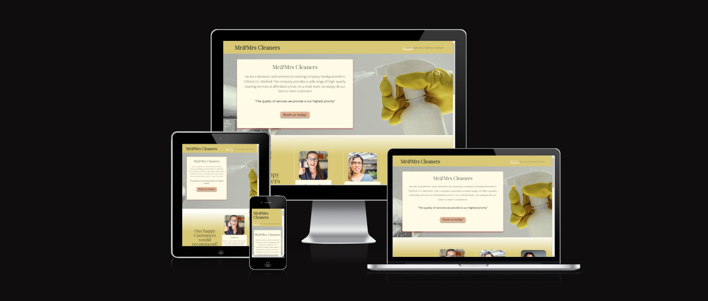
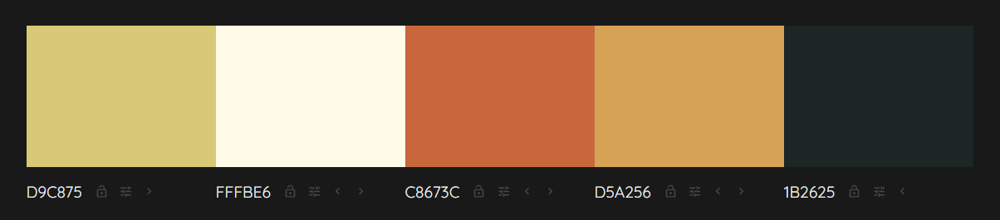
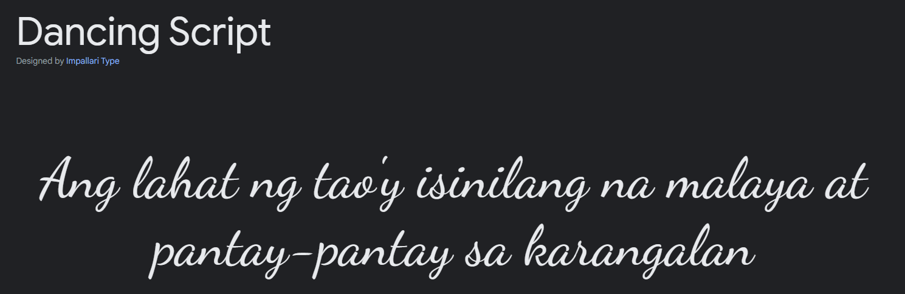
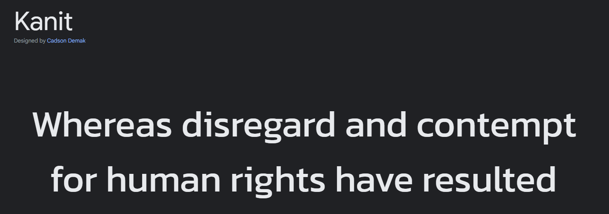
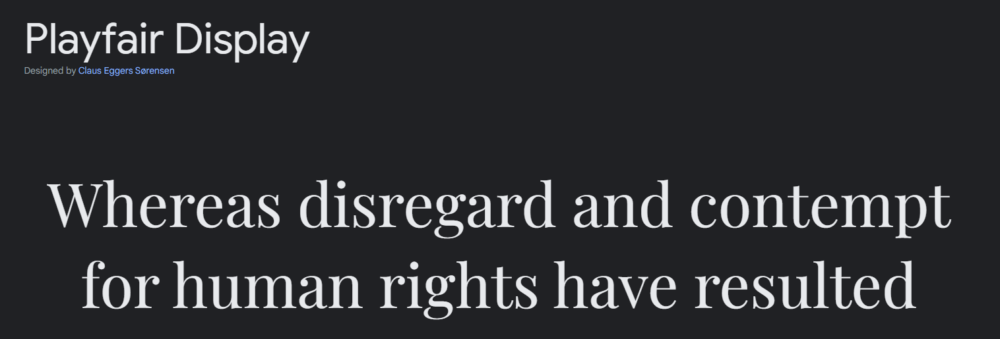

# __Portfolio Project 1 - HTML/CSS Essentials__

Mr&Mrs Cleaners is a variation on live [business webpage](https://mrsandmrcleaner.ie/) of my friends and is intended to showcase new web-technologies (like HTML and CSS) and new, atractive solution to presenting their business content to potential new customers

## __Live Web-Page__
[Mr&Mrs Cleaners](https://shemmyyo.github.io/mr-and-mrs-cleaners/)

## __GitHub Repository__
[https://github.com/ShemmyYo/mr-and-mrs-cleaners](https://github.com/ShemmyYo/mr-and-mrs-cleaners)

## __Tech Stack__

 __HTML5__
 __CSS3__
 __Gitpod__
 __Git__

***

## __Contents__

- [Project Goals](#project-goals)
- [Brief](#brief)
- [Target Audience](#target-audience)
- [UX User Experience](#ux-user-experience)
    - [User Stories](#user-stories)
    - [Initial Concept](#initial-concept)
    - [Wireframes](#wireframes)
    - [Site Structure](#site-structure)
    - [Colour Scheme](#colour-scheme)
    - [Typography](#typography)
    - [Imagery](#imagery)
- [Features](#features)
    - [Existing Features](#existing-features)
        - [Home](#home)
        - [Services](#services)
        - [Gallery](#gallry)
        - [Contact](#contact)
        - [Form Confirmation](#form-confirmation)
- [Technologies Used](#technologies-used)
- [Testing](#testing)
- [Deployment](#deployment)
    - [To Fork the Repository](#to-fork-the-repository)
    - [To create a Local Clone](#to-create-a-local-clone)
- [Credits](#credits)
    - [Code](#code)
    - [Design](#design)
    - [Content](#content)
    - [Media](#media) 
- [Acknowledgements](#acknowledgements)

***

## __Project Goals__
This project has two main objectives: 
- To showcase web-technologies like HTML and CSS in compelling static front end application to present content to potential new customers
- To demonstrate my competency as a developer using HMTL & CSS languages

## __Brief__

TBC

## __Target Audience__

***

## __UX User Experience__

### __User Stories__ 

### __Initial Concept__

### __Wireframes__

Home Page:

Services Page:

Gallery Page:

Contact Page:

Contact Page:

#### __Tablet__ 

#### __Desktop__ 

***

### __Site Structure__

Mr&Mrs Cleaners is a 5 page website. 
The home page is the default loading page, 3 pages are accessible from the navigation menu at all times and 1 page is only displayed on Contact Page Form submittion.  

### __Colour Scheme__

I used  [Colormind](http://colormind.io/bootstrap/) to find a perfect colour scheme that would tie-in with the nature of the business, be easily readable and visually appealing to users.

### __Typography__

The three fonts used were imported into the css from [google fonts](https://fonts.google.com/)
I used 'Dancing Script' for logo, 'Kanit' for all headings & 'Playfair Display' for any other text

Sans-serif is the nominated fallback font

### __Imagery__

The images have been compressed in [compressor.io](https://compressor.io/) to enable faster loading times. 
The content images on Gallery Page are aligned in neat symmetrical grids for optimal viewing and user experience. 

***

## __Features__

Mr&Mrc Cleaners webpage contains  features such as a navigational bar, service certificates, contact details and footer, familiar to all internet users. This creates a friendly and non intimidating environment in which the user can feel comfortable to explore the pages, make return visits, and enjoy a positive user experience.

### __Existing Features__

#### __Home__

##### __Navigational Bar__

##### __Footer__

#### __Gallery__

#### __Contact__

#### __Form Confirmation__

***

## __Technologies Used__

- [HTML5](https://html.spec.whatwg.org/) - provides content and structure 
- [CSS](https://www.w3.org/Style/CSS/Overview.en.html) - provides styling 
- [Balsamiq](https://balsamiq.com/) - for wireframes
- [Eagle](https://en.eagle.cool/) - to collect, search and organize your design files in a logical way and all in one place
- [Font Awesome](https://fontawesome.com/) - multiple icons implemented throughout the site from font awesome version 5
- [Google Fonts](https://fonts.google.com/) - All three fonts used in the website imported from here 
- [CSS Gradient](https://cssgradient.io/) - created a gradient background for websites
- [Chrome Dev Tools](https://developer.chrome.com/docs/devtools/) - used extensively to experiment with grid, flexbox and general responsiveness.
- [Gitpod](https://www.gitpod.io/) - used to used to create and host the website
- [Github](https://github.com/) - used to deploy the website 
- [Am I Responsive](https://ui.dev/amiresponsive) - to create an image displaying the home page on various devices 
- [Grammarly](https://app.grammarly.com/) - to  make writing clear and engaging as well as eliminate grammar errors.

***

## __Testing__

***

## __Deployment__

The site was deployed to GitHub

### __Deploy to GitHub Pages__

1. Navigate to the settings tab in the GitHub repository 
2. Once in settings, navigate to the pages tab on the left of the page 
3. Under source, select branch ‘master’ and then click ‘save’
4. page will no automatically refresh and show a detailed ribbon display to indicate deployment 

### __To Fork the Repository__ 

To make a copy or ‘fork’ the repository - 

1. Log into GitHub and locate repository 
2. On the right hand side of the page select the ‘fork’ option to create and copy of the original

***

## __Credits__

### __Code__

Throughout the building process I found many helpful tutorials online. 
I sometimes applied principles within them to the site, after fully understanding their code and modifying to fit the site's needs. 

- The service page was inspired by Code Institute's 'Love Running' project with some tweaks to adjust to fit Mr&Mrs Cleaners page and content
- The image gallery was inspired by Kevin Powell [tutorial](https://www.youtube.com/watch?v=rg7Fvvl3taU&t=1968s)
TBC

### __Design__

- Design files incl. content, references and images were collected and organised with [Eagle](https://en.eagle.cool/)
- Wireframes were made using [Balsamiq](https://balsamiq.com/)
- Colour Scheem was chosen with  [Colormind](http://colormind.io/bootstrap/)

### __Content__

- Many issues were at least partly resolved by searching ...  
- Harry... 
- Inspiration for the README.md came from  

### __Media__

- All photos ... TBC
- https://stock.adobe.com/

## __Acknowledgements__ 
This website was executed and completed as a Portfolio 1 Project for the Full Stack Software Developer Diploma at [Code Institute](https://codeinstitute.net/). 

Shemmy, 2022